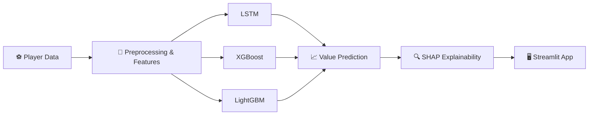
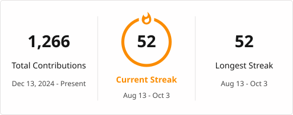

<!-- ===================== HEADER BANNER ===================== -->
<div align="center">


<!-- Typing animation -->
<a href="https://github.com/BuildbyArindam">
  
</a>

<br/>

<a href="https://www.linkedin.com/in/arindam-mahapatra-996305280/" target="_blank">
  
</a>
<a href="mailto:mahapatraarindam4@gmail.com">
  
</a>
<a href="https://github.com/BuildbyArindam?tab=repositories">
  
</a>


<br/><br/>


</div>

<br/>

---

## 👨‍💻 About Me

<table>
<tr>
<td width="60%" valign="top">

```python
class Arindam:
    def __init__(self):
        self.role      = "Generative AI Intern @ SureTrust"
        self.education = "B.Tech CSE, Cooch Behar Govt. Engineering College"
        self.cgpa      = "8.4 / 10  (2026)"
        self.interests = ["Generative AI", "Applied ML", "Data Science"]
        self.studying  = "GRE  →  MS in Computer Science"
        self.status    = "Actively looking for opportunities 🚀"

    def say_hi(self):
        print("Thanks for stopping by! Let's build something.")
```

</td>
<td width="40%" valign="top">

### 🔭 Right Now
- 💼 **Generative AI Intern** at **SureTrust**
- 📚 Preparing for the **GRE**
- 🎯 Aiming for an **MS in CS** abroad
- ⚡ Exploring GenAI, applied ML & data science

</td>
</tr>
</table>

---

## 🧭 Experience & Credentials

| | |
|---|---|
| 💼 **Generative AI Intern** | SureTrust *(current)* |
| 📊 **Data Analytics Intern** | Deloitte |
| 🤖 **AI Engineering Intern** | Infosys Springboard |
| 🎓 **B.Tech, Computer Science & Engineering** | Cooch Behar Government Engineering College · CGPA 8.4/10 · 2026 |
| 📜 **Oracle Agentic AI Foundations Associate** | Certified · 2026 |

---

## 🛠️ Tech Stack

<div align="center">


<br/><br/>


</div>

<details>
<summary><b>🔎 Click to see my stack grouped by purpose</b></summary>
<br/>

| Area | Tools |
|---|---|
| **Languages** | Python, SQL |
| **Deep Learning** | PyTorch, TensorFlow (LSTM) |
| **Classical ML** | scikit-learn, XGBoost, LightGBM |
| **Explainability** | SHAP |
| **Data** | Pandas, NumPy |
| **Apps & Tooling** | Streamlit, Git, Google Colab |

</details>

---

## 🚀 Featured Project: TransferIQ

> **Football player market-value prediction, with explanations you can actually read.**



<div align="center">
  <a href="https://github.com/BuildbyArindam/TRANSFRIQ">
    
  </a>
</div>

---

## 📌 More Projects

<div align="center">

<a href="https://github.com/BuildbyArindam/TRANSFRIQ">
  
</a>
<a href="https://github.com/BuildbyArindam/smart-attendance-system">
  
</a>
<br/>
<a href="https://github.com/BuildbyArindam/Smart-Water-Conservation-Assistant">
  
</a>
<a href="https://github.com/BuildbyArindam/MentalHealthSupport">
  
</a>

</div>

<details>
<summary><b>📋 Project summaries (plain list)</b></summary>
<br/>

| Project | Description |
|---|---|
| [TRANSFRIQ](https://github.com/BuildbyArindam/TRANSFRIQ) | Football player market-value prediction using LSTM, XGBoost & LightGBM with SHAP explainability |
| [smart-attendance-system](https://github.com/BuildbyArindam/smart-attendance-system) | Smart attendance & sentiment analysis system built as B.Tech capstone |
| [Smart-Water-Conservation-Assistant](https://github.com/BuildbyArindam/Smart-Water-Conservation-Assistant) | JavaScript-based assistant for water conservation tracking |
| [MentalHealthSupport](https://github.com/BuildbyArindam/MentalHealthSupport) | Python project focused on mental health support tooling |

</details>

---

## 📊 GitHub Stats

<div align="center">


<br/>



<br/><br/>


</div>

---

## 🎯 Goals

- [x] Complete B.Tech in Computer Science & Engineering
- [x] Intern across GenAI, data analytics, and AI engineering
- [x] Earn the Oracle Agentic AI Foundations Associate certification
- [ ] Crack the GRE
- [ ] Secure an MS in Computer Science abroad
- [ ] Ship more production-grade GenAI applications

---

## 🤝 Let's Connect

<div align="center">

I'm actively looking for **Generative AI / Data Science / ML Engineering** opportunities.<br/>
If you have a role, a project, or just an idea, I'd love to hear from you.

<br/>

<a href="https://www.linkedin.com/in/arindam-mahapatra-996305280/">
  
</a>
<a href="mailto:mahapatraarindam4@gmail.com">
  
</a>

<br/><br/>

<i>"Data tells the story. Models predict the next chapter." ✨</i>


</div>
