<div align="center">



<br/>

**[about](#about)** · **[now](#now)** · **[log](#log)** · **[stack](#stack)** · **[projects](#projects)** · **[telemetry](#telemetry)** · **[roadmap](#roadmap)** · **[contact](#contact)**

</div>

<br/>

## ~/about

> [!NOTE]
> Hi, I'm Arindam. I build with LLMs and applied ML, and I like models whose decisions I can explain.

```text
arindam@buildby
───────────────────────────────────────────────────────────────
role ........ Generative AI Intern @ SureTrust
degree ...... B.Tech CSE · Cooch Behar Govt. Engineering College
cgpa ........ 8.4 / 10  (2026)
cert ........ Oracle Agentic AI Foundations Associate (2026)
interests ... Generative AI · Applied ML · Data Science
next ........ GRE → MS in Computer Science, abroad
status ...... open to opportunities
```

<br/>

## ~/now

| 🔨 Building | 📖 Preparing | 🔎 Looking for |
|:--|:--|:--|
| GenAI work as an intern at **SureTrust**, plus projects like **TransferIQ** | The **GRE**, aiming for an **MS in Computer Science** abroad | **Generative AI**, **Data Science** and **ML Engineering** roles |

<sub>Also practising data structures & algorithms daily in <a href="https://github.com/BuildbyArindam/Daily-Coding-Log">Daily-Coding-Log</a>.</sub>

<br/>

## ~/log

```text
$ git log --graph --oneline

* (goal)         MS in Computer Science, abroad
|
* (HEAD -> main) Generative AI Intern · SureTrust
* (tag: 2026)    Oracle Agentic AI Foundations Associate · Certified
* (tag: 2026)    B.Tech CSE · Cooch Behar Govt. Engineering College · CGPA 8.4
* Data Analytics Intern · Deloitte
* AI Engineering Intern · Infosys Springboard
```

<br/>

## ~/stack

```yaml
languages:        [Python, SQL]
deep_learning:    [PyTorch, TensorFlow, LSTM]
machine_learning: [scikit-learn, XGBoost, LightGBM]
explainability:   [SHAP]
data:             [Pandas, NumPy]
apps_and_tools:   [Streamlit, Git, Google Colab]
exploring:        [Generative AI, Agentic AI]
```

<br/>

## ~/projects

### ⚽ Flagship: TransferIQ

Predicts football player market value, then explains each prediction with SHAP.

```text
player data ─▶ features ─▶ ┌ LSTM     ┐
                           ├ XGBoost  ├─▶ market value ─▶ SHAP ─▶ Streamlit app
                           └ LightGBM ┘
```

<kbd>LSTM</kbd> <kbd>XGBoost</kbd> <kbd>LightGBM</kbd> <kbd>SHAP</kbd> <kbd>Streamlit</kbd> · **[open repository →](https://github.com/BuildbyArindam/TRANSFRIQ)**

<br/>

<table>
<tr>
<td width="50%" valign="top">

**🎓 [smart-attendance-system](https://github.com/BuildbyArindam/smart-attendance-system)**<br/>
Smart attendance and sentiment analysis system, built as my B.Tech capstone.

</td>
<td width="50%" valign="top">

**💧 [Smart-Water-Conservation-Assistant](https://github.com/BuildbyArindam/Smart-Water-Conservation-Assistant)**<br/>
JavaScript-based assistant for tracking water conservation.<br/>
<kbd>JavaScript</kbd>

</td>
</tr>
<tr>
<td width="50%" valign="top">

**🧠 [MentalHealthSupport](https://github.com/BuildbyArindam/MentalHealthSupport)**<br/>
Python project focused on mental health support tooling.<br/>
<kbd>Python</kbd>

</td>
<td width="50%" valign="top">

**📓 [Daily-Coding-Log](https://github.com/BuildbyArindam/Daily-Coding-Log)**<br/>
A public log of daily DSA practice across multiple coding platforms.<br/>
<kbd>Python</kbd> <kbd>C++</kbd> <kbd>Java</kbd> <kbd>SQL</kbd>

</td>
</tr>
</table>

<br/>

## ~/telemetry

<div align="center">


</div>

<br/>

## ~/roadmap

| ✅ Shipped | 🔨 In progress | 🧭 Next |
|:--|:--|:--|
| B.Tech in CSE (2026) | GenAI internship at SureTrust | MS in Computer Science, abroad |
| Internships at Deloitte & Infosys Springboard | GRE preparation | Production-grade GenAI applications |
| TransferIQ | Daily DSA practice | |
| Oracle Agentic AI Foundations Associate | | |

<br/>

## ~/contact

```bash
$ ./contact.sh --open-to "Generative AI | Data Science | ML Engineering"
```

|  |  |
|:--|:--|
| 💼 **LinkedIn** | [arindam-mahapatra](https://www.linkedin.com/in/arindam-mahapatra-996305280/) |
| 📧 **Email** | [mahapatraarindam4@gmail.com](mailto:mahapatraarindam4@gmail.com) |
| 🐙 **GitHub** | [@BuildbyArindam](https://github.com/BuildbyArindam) |

<details>
<summary><sub>🥚 psst, click if you're curious</sub></summary>

<br/>

```text
>>> import this_profile
>>> this_profile.motto
'Data tells the story. Models predict the next chapter.'
```

</details>

<br/>

<div align="center">
<sub><code>exit 0</code> · thanks for stopping by</sub>
</div>
